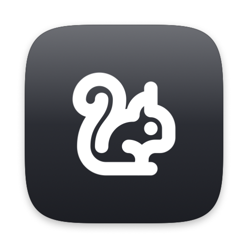

  

<h1 align="center">🐿️ Squirrel Trap</h1>

<b>Catches you right before you get distracted — every Cmd+Tab becomes a chance to name what you're about to do.</b>

  
  
  

<!--
Demo goes here once recorded — drop the file at docs/demo.gif (or docs/demo.mp4)
and uncomment one of these:

  <video src="docs/demo.mp4" width="640" controls muted playsinline></video>

-->

Every time you press **Cmd+Tab**, Squirrel Trap pops up a small floating prompt asking "what are you about to do?" — the moment right before a keyboard-driven app switch is exactly when it's easiest to get sidetracked chasing something unrelated. It also keeps a running checklist of what you said, so you can check things off as you actually get to them.

**[⬇ Download the latest release](../../releases/latest)**

## Features

- **A prompt right when it matters** — Cmd+Tab pops up a floating "what are you about to do?" box, with zero setup beyond one permission grant.
- **Favorites** — save a to-do you log often and re-add it in a single click.
- **Snooze** — need a stretch of uninterrupted Cmd+Tab? Snooze suppresses just the prompt for a set number of minutes (configurable) without quitting the app.
- **Reminders sync** — optionally sync your list with an Apple Reminders list, one-directional or bidirectional, your choice.
- **iCloud sync** — keep your list in sync across every Mac you use, always bidirectional, powered by CloudKit push notifications for near-instant updates.
- **Default Alarm** — optionally have every new to-do automatically get a reminder after a set amount of time, no extra tap required.
- **Color tags** — tag any pending item with one of 16 preset colors, Trello-style, for a quick visual sort at a glance. A **Default Color** setting can apply one automatically to every new to-do.
- **Streaks & activity** — a quiet day-streak and today's completed count sit on the main panel, with a satisfying little animation each time you finish something. A 7-day activity graph in Preferences shows your best day and your average.
- **Plays well with Dictation / Wispr Flow** — the text field is a normal macOS text field, so voice-to-text tools work out of the box.

## Download

Unzip it and drag `Squirrel Trap.app` anywhere you like (your Applications folder, or just your Desktop — it doesn't matter). It's signed with a Developer ID certificate and notarized by Apple, so it just opens normally — no security warnings, no workarounds needed.

## First launch

Squirrel Trap needs **Input Monitoring** permission to detect the Cmd+Tab keypress — it's a passive, listen-only observation and never records anything else you type. The app will show you a one-time explainer with a "Grant Access" button.

If it doesn't show up automatically in **System Settings → Privacy & Security → Input Monitoring**, click the **+** button there and add `Squirrel Trap.app` manually, then toggle it on.

## What it does with your data

Everything you log is stored locally at `~/Library/Application Support/SquirrelTrap/` by default, in a plain (unencrypted) JSON file — no account, no server, nothing leaves your Mac unless you turn on sync or usage sharing yourself. **FileVault is what actually protects this file at rest** if your Mac is lost or stolen; without it, anyone with local access to the disk can read your to-do history in plain text.

Three things are off by default and opt-in in Preferences:
- **Reminders sync** shares your to-dos with a list in Apple's own Reminders app, on your terms (you choose the direction).
- **iCloud sync** keeps your list in step across your own Macs via your private iCloud account — Apple's CloudKit, not a third-party server.
- **Share Usage Data** sends anonymous product-analytics events (which features get used, never your to-do text) to help guide development.

Nothing else sends anything anywhere, and all three stay off unless you switch them on.

## Feedback

This is an early, personal project — if something breaks or feels off, that's genuinely useful to know. [Open a GitHub Issue](../../issues) or reach me directly.

## Uninstalling

1. Quit Squirrel Trap — right-click the menu bar icon → Quit, or use the "Quit Squirrel Trap" button in Preferences.
2. Delete `Squirrel Trap.app` (wherever you put it — Applications, Desktop, etc.) by dragging it to the Trash.
3. If you turned on **Launch at Login**, remove it from System Settings → General → Login Items & Extensions.
4. To also clear your logged history and preferences, delete:
   - `~/Library/Application Support/SquirrelTrap/`
   - `~/Library/Preferences/com.jtoeman.squirreltrap.plist`
5. Optional: remove Squirrel Trap from System Settings → Privacy & Security → Input Monitoring — harmless to leave, but tidy to remove.

That's everything — Squirrel Trap doesn't touch anything else on your Mac.

## License

All rights reserved — see [LICENSE](LICENSE). The source is public for transparency; the download above is the intended way to use the app.

## Notes

Conceived by human, coded by Claude, logo design by ChatGPT
